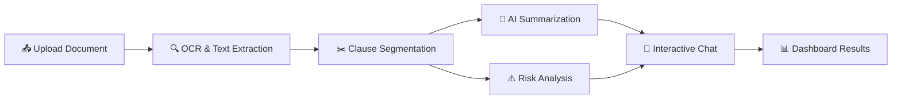

# 📋 Legal Document Demystifier

<div align="center">


*Making complex legal documents understandable, actionable, and safe for everyone* 🚀

</div>

---

## ✨ What is Legal Document Demystifier?

Ever felt overwhelmed by dense legal jargon? Our AI-powered web application transforms complex legal documents into clear, actionable insights that anyone can understand! Whether you're reviewing a rental agreement, employment contract, or any legal document, we've got you covered.

### 🎯 Why Choose Us?

- 🔍 **No More Legal Jargon** - Get plain-English explanations
- ⚡ **Lightning Fast** - Process documents in seconds
- 🛡️ **100% Private** - Your documents stay secure with encryption
- 🤖 **AI-Powered** - Advanced machine learning for accurate analysis
- 💬 **Interactive** - Chat with your document like a legal expert

---

## 🌟 Key Features

<table>
<tr>
<td width="50%">

### 📄 **Smart Document Processing**
- Upload PDFs, images, or paste text directly
- Advanced OCR technology for scanned documents
- Support for multiple file formats

### 🧠 **Intelligent Analysis**
- AI-powered summarization in plain language
- Automatic clause segmentation and identification
- Smart risk scoring and highlighting

</td>
<td width="50%">

### 💬 **Interactive Chatbot**
- Ask questions about your document
- Get contextual answers with citations
- RAG-powered responses for accuracy

### 🔒 **Privacy & Security**
- End-to-end encryption for all documents
- User-controlled data deletion
- No external API dependencies

</td>
</tr>
</table>

---

## 🚀 How It Works

<div align="center">



</div>

### Step-by-Step Process:

1. **📤 Upload** → Drop your PDF, image, or paste text
2. **🔍 Extract** → Advanced OCR extracts all text content
3. **✂️ Segment** → AI identifies and separates legal clauses
4. **📝 Summarize** → Generate easy-to-understand summaries
5. **⚠️ Analyze** → Score and highlight potential risks
6. **💬 Chat** → Ask questions and get instant answers
7. **📊 Export** → Download summaries and chat transcripts

---

## 🛠️ Installation & Setup

### Prerequisites
- Python 3.9 or higher
- Git
- (Optional) Tesseract OCR for better PDF processing

### Quick Start

<details>
<summary><b>📋 Step-by-Step Installation</b></summary>

1. **Clone the repository:**
   ```bash
   git clone https://github.com/Athul-S-369/Legal-Doc-Demystifier.git
   cd Legal-Doc-Demystifier
   ```

2. **Create virtual environment:**
   ```bash
   python -m venv .venv
   
   # Windows
   .venv\Scripts\activate
   
   # Linux/Mac
   source .venv/bin/activate
   ```

3. **Install dependencies:**
   ```bash
   pip install -r requirements.txt
   ```

4. **For enhanced OCR (Windows):**
   - Download and install [Tesseract OCR](https://github.com/UB-Mannheim/tesseract/wiki)
   - Download and install [Poppler for Windows](https://blog.alivate.com.au/poppler-windows/)
   - Set environment variables:
     ```bash
     set TESSERACT_CMD=C:\Program Files\Tesseract-OCR\tesseract.exe
     set POPPLER_PATH=C:\poppler\bin
     ```

</details>

### 🚀 Running the Application

```bash
python run.py
```


---

## 🎮 How to Use

### Method 1: Upload Documents
1. 📤 **Upload** a PDF, image, or text file
2. ⏳ **Wait** for AI processing (usually 5-10 seconds)
3. 📊 **Review** the summary and risk analysis
4. 💬 **Chat** with your document

### Method 2: Paste Text
1. 📝 **Paste** your contract text directly
2. ⚡ **Get instant** analysis and insights
3. 🔍 **Explore** risks and ask questions

### What You'll Get:
- 📋 **Plain-English Summary** - No more legal jargon!
- ⚠️ **Risk Analysis** - Highlighted potential issues
- 💬 **Interactive Chat** - Ask specific questions
- 📥 **Export Options** - Download summaries and transcripts

---

## 🛠️ Technology Stack

<div align="center">

| Category | Technology | Purpose |
|----------|------------|---------|
| 🐍 **Backend** | Flask (Python) | Web framework |
| 🔍 **OCR** | Tesseract, PyPDF2, pdf2image | Text extraction |
| 🤖 **AI/ML** | sentence-transformers, FAISS | Vector embeddings & retrieval |
| 📝 **Text Processing** | Custom TextRank | Smart summarization |
| 🔒 **Security** | Fernet encryption | Document protection |
| 🎨 **Frontend** | HTML, CSS, JavaScript | User interface |

</div>

---

## 📁 Project Structure

```
📦 Legal-Doc-Demystifier/
├── 🐍 app/
│   ├── 🔧 services/
│   │   ├── ocr.py          # 📄 Text extraction from PDFs/images
│   │   ├── segment.py      # ✂️ Clause segmentation
│   │   ├── summarize.py    # 📝 TextRank summarization
│   │   ├── risk.py         # ⚠️ Risk analysis heuristics
│   │   ├── embeddings.py   # 🧠 FAISS vector indexing
│   │   ├── rag_chat.py     # 💬 RAG chatbot
│   │   └── storage.py      # 🔒 Encrypted storage
│   ├── 🎨 templates/       # HTML templates
│   ├── 🎨 static/         # CSS/JS assets
│   └── 🛣️ routes.py       # Flask routes
├── 📁 data/               # Document storage (encrypted)
├── 🤖 models/            # AI model storage
└── 📋 requirements.txt   # Python dependencies
```

---

## 🤝 Contributing

We welcome contributions! Here's how you can help:

1. 🍴 **Fork** the repository
2. 🌿 **Create** a feature branch (`git checkout -b feature/amazing-feature`)
3. 💾 **Commit** your changes (`git commit -m 'Add amazing feature'`)
4. 📤 **Push** to the branch (`git push origin feature/amazing-feature`)
5. 🔄 **Open** a Pull Request

### 🐛 Found a Bug?
- Open an issue with the `bug` label
- Provide steps to reproduce
- Include system information

### 💡 Have an Idea?
- Open an issue with the `enhancement` label
- Describe your feature idea
- Explain the use case

---

## 📄 License

This project is licensed under the MIT License - see the [LICENSE](LICENSE) file for details.

---

## 🆘 Support & Contact

<div align="center">

### 💬 Need Help?

[](https://github.com/Athul-S-369/Legal-Doc-Demystifier/issues)
[](https://github.com/Athul-S-369/Legal-Doc-Demystifier/stargazers)
[](https://github.com/Athul-S-369/Legal-Doc-Demystifier/network)

**For questions, issues, or feature requests, please open an issue on GitHub.**

---

## 👥 Made with ❤️ by Team Atomic

<div align="center">

### 🚀 **Team Atomic** - Building the Future of Legal Tech

**Lead Developer:** [Athul S](https://github.com/Athul-S-369)

*"Democratizing legal knowledge through AI"*

---


</div>
